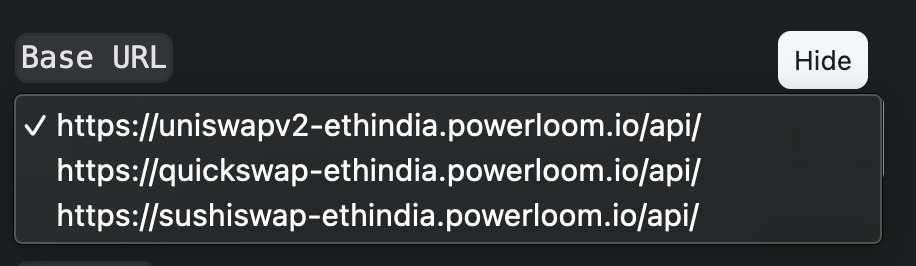
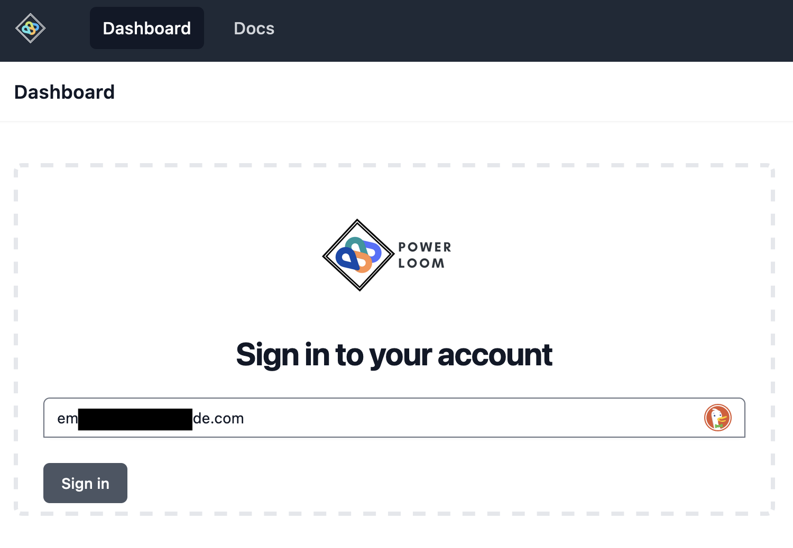
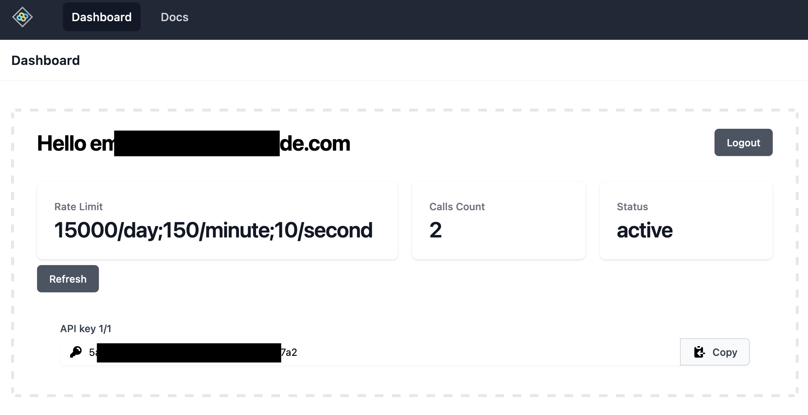

# Pooler API Overview and Endpoints

## Overview

This is the API documentation to access various data points snapshotted by PowerLoom protocol. This is *exclusively* for hackers participating in [ETH India 2022](https://www.notion.so/Powerloom-Protocol-EthIndia-2022-9dabaa6bf419406889f943ac90276c33)!

The snapshotting is currently done on various Defi protocols like UniswapV2(running on Eth), SushiSwap(running on Eth), and QuickSwap (running on Polygon)


## Hosted API

You can try out the APIs directly from this website. `base_url` is in the given format - `https://<protocol>.powerloom.io/api` where `protocol` can be `quickswap-ethindia`, `sushiswap-ethindia`, `uniswapv2-ethindia`.



All the API endpoints are available for the given protocols.

```
💡 While the endpoints allow nominal usage for public access without an API key, we **do not** recommend them for developers. Doing so can severely restrict access to your IP address.
```

### Steps to generate API key for privileged access

Follow the steps to generate the API key to access the mentioned API endpoints in the postman collection:

1. Visit [ETHIndia Hacker Dashboard](https://ethindia22.powerloom.io/) and enter your email to Sign In.



1. You will see a pop-up as shown below. *Note: Don’t close this tab*
    
    
    
2. Login through the link provided on the email and go back to the [Dashboard](https://ethindia22.powerloom.io/) tab to get the API key. It should look as shown below
    
    
    

## API Responses

*Note: All the APIs are HTTP GET and return a response code of* 

- *200 along with a JSON response on success*
- *404 in case of NOT Found.*
    
    Note: Most of the fields in the response are self-explanatory, the ones that need explicit brief are mentioned in the table below.