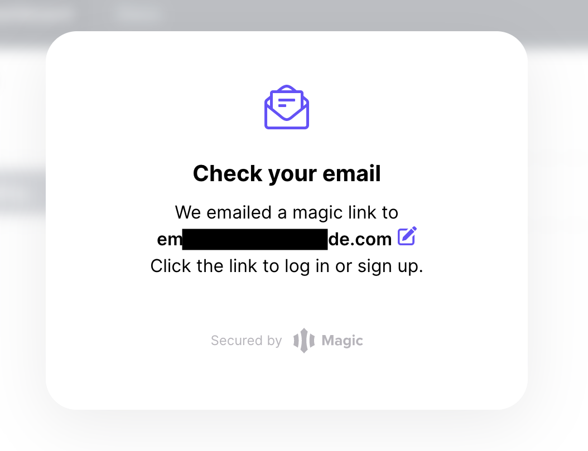

# Snapshotter core API Overview and Endpoints

## Overview

The Snapshotter core API endpoints documented on the sidepane are connector APIs that adapt the low level APIs opened up by a Snapshotter Node. The connectors ensure that the low level details are hidden from developers interested in datapoints and logic specific to a use case. They have been [opened up on hosted instances](#hosted-api) of Pooler that snapshot different DeFi protocol data that are compatible with Uniswap v2 AMM architecture:
* Uniswap v2(Ethereum mainnet)
* Phase 2 Quests (ZkEvm mainnet)


## Hosted API
You can try out the APIs directly from this website. `base_url` is in the given format - `https://<protocol>.powerloom.io/api` where `protocol` can be `uniswapv2`, `phase2`.


All the API endpoints are available for the given protocols.

```
💡 While the endpoints allow nominal usage for public access without an API key, we **do not** recommend them for developers. Doing so can severely restrict access to your IP address.
```

### Steps to generate API key for privileged access

Follow the steps to generate the API key to access the mentioned API endpoints in the postman collection:

1. Visit [Pooler API Dashboard](https://pooler-api-dashboard.powerloom.io/) and enter your email to Sign In.


1. You will see a pop-up as shown below. *Note: Don’t close this tab*
    
    
    
2. Login through the link provided on the email and go back to the [Dashboard](https://pooler-api-dashboard.powerloom.io/) tab to get the API key. It should look as shown below
    
    
    
