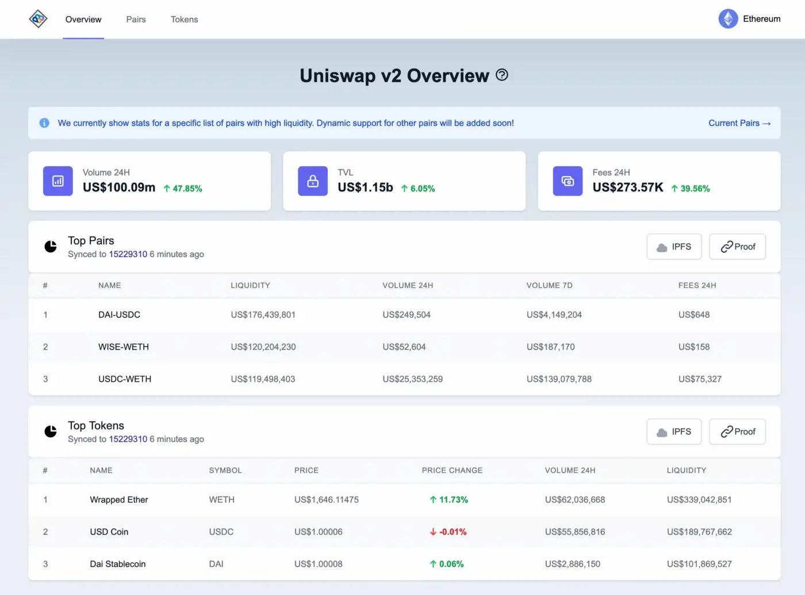

# Getting Started

This page contains detailled instructions on how to run a Powerloom Pooler.

:::note Major technical skills required

These instructions are aimed at indivituals with extensive experience in handling unix shells, computer hardware, networking and container technologies. With Powerloom currently in early testnet phase, the Powerloom team is specifically looking for experienced technicians to run and operate testnet Pooler nodes.

:::

## Cloud VS physical deployment
Deploying a Pooler can be done either on cloud providers like AWS, or on physical systems. There are pros and cons to both approaches.
While a cloud deployment involves less overhead in managing it, and is often cheaper for smaller deployments, cloud infrastructures get expensive very fast. Also, running nodes on cloud infrastructures weakens the network's overall decentralization.
On the other hand, a physical deployment (sometimes called "on-premise", or "bare-metal") requires a lot more knowledge, time and work to setup and operate. It can lead to cost savings, and helps improve the hardware decentralization of the protocol.

## Requirements

1. Latest version of `docker` (`>= 20.10.21`) and `docker-compose` (`>= v2.13.0`)
2. At least 4 core CPU, 8GB RAM (preferably ECC) and 50GB SSD - make sure to choose the correct spec when deploying to Github Codespaces.
3. A fiber internet connection
4. IPFS node
    - While we have __included__ a node in our autobuild docker setup, IPFS daemon can hog __*a lot*__ of resources - it is not recommended to run this on a personal computer unless you have a strong internet connection and dedicated CPU+RAM.
    - 3rd party IPFS services that provide default IFPS interface like Infura are now supported.
5. RPC URL for `Ethereum mainnet`. We recommend running a full geth node to save costs and to stick to ethos of decentralization! :)
> Our default (lite mode) setup is designed to work well with a free plan on any of the RPC providers like [Alchemy](https://alchemy.com/?r=15ce6db6d0a109d5), [Infura](https://infura.io), [Quicknode](https://www.quicknode.com?tap_a=67226-09396e&tap_s=3491854-f4a458), etc. It even works with Ankr's [public endpoint](https://rpc.ankr.com/eth) but we recommend signing up to track usage. For those interested in exploring the the full setup, we can also arrange for a special pan through our partners such as BlockVigil.

## Setting up the Pooler

1. Clone the [Powerloom deploy repository](https://github.com/PowerLoom/deploy/):
    ```shell
    git clone https://github.com/PowerLoom/deploy.git
    cd deploy
    ```
2. Copy `env.example` to `.env`.
   - Ensure the following required variables are set:
     - `SOURCE_RPC_URL`: The URL for the source RPC service.
     - `SIGNER_ACCOUNT_ADDRESS`: The address of the signer account.
     - `SIGNER_ACCOUNT_PRIVATE_KEY`: The private key corresponding to the signer account address.
   - Optionally, you may also set the following variables:
     - `PROST_RPC_URL`: The URL for the PROST RPC service.
     - `IPFS_URL`: The URL for the IPFS (InterPlanetary File System) service in HTTP(s) (e.g. `https://ipfs.infura.io:5001`) multiaddr format (e.g. `/dns4/ipfs.infura.io/tcp/5001/https`)
     - `IPFS_API_KEY`: The API key for the IPFS service (if required).
     - `IPFS_API_SECRET`: The API secret for the IPFS service (if required).
     - `PROTOCOL_STATE_CONTRACT`: The contract address for the protocol state.
     - `RELAYER_HOST`: The host address for the relayer.
     - `SLACK_REPORTING_URL`: The URL for reporting to Slack.
     - `POWERLOOM_REPORTING_URL`: The URL for reporting to PowerLoom.
     - `WEB3_STORAGE_TOKEN`: The token for Web3.Storage. You can generate or retrieve this token from your [API tokens page](https://web3.storage/tokens/?create=true) after signing up for a free plan at web3.storage.

## Starting the Pooler

To start the pooler node, run the following command (ideally in an concurrent shell, like `screen`):

```shell
./build.sh
```

## Accessing the Pooler data

Once all the services are up and running, the Pooler node should be serving a Uniswap V2 summary dashboard (running by default on [http://localhost:3000](http://localhost:3000)). This dashboard should be similar to the [PowerLoom UNISWAPV2 Prod](https://uniswapv2.powerloom.io/).


This dashboard allows you to monitor your Pooler activity. Note that the data shown in your own dashboard will not be same as production UI on PowerLoom.io as the default "lite mode" of the Pooler will only snapshot 7 pair contracts.

## Stopping the Pooler
To stop a running Pooler node, either kill the running process with `ps` and `kill`. Alternatively, in the Pooler's shell, use `Ctrl+C` twice to force a shutdown.
:::warning Keeping your node running

For security and availability reasons, the powerloom consensus, including the Poolers, are expected to be up and running with close to 100% uptime. Shutting down your node for extended periods of time can lead to a **__de-activation of your snapshotter account__**.

:::

## Troubleshooting
### Corrupted storage
The Pooler storage can get corrupted as a result of snapshotter network instability.
In that case, you can reset the Pooler storage:

    ```shell
    docker-compose --profile ipfs down --volumes
    ```
After this, you can [restart your Pooler](#starting-the-pooler-node)

## What's next ?

- Join us on [Discord](https://discord.com/invite/powerloom)
- Check out the [Pooler RPC API specifications](./API/overview.md)
- Visit the consensus dashboard at [consensus.powerloom.io](https://onchain-consensus.powerloom.io)
