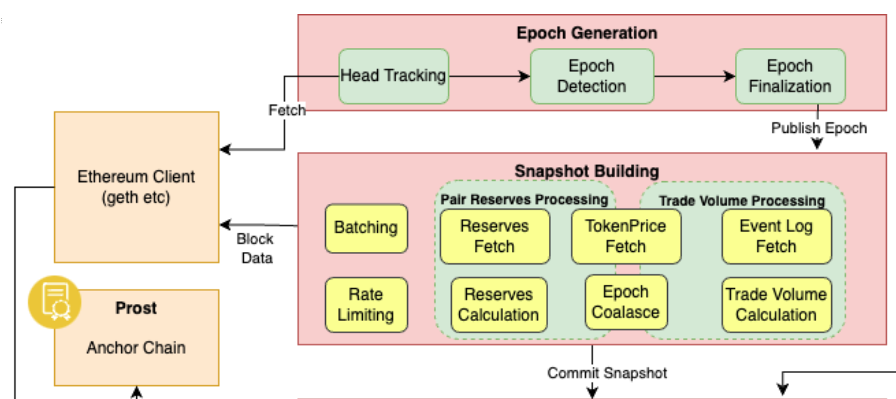

# Pooler Intro

## Overview

Pooler is the component of a fully functional, distributed system that works alongside Audit Protocol and together they are responsible for
* generating a time series database of changes occuring over smart contract state data and event logs, that live on decentralized storage protocols
* higher order aggregated information calculated over decentralized indexes maintained atop the database mentioned above

Pooler by itself, performs the following functions:

1. Tracks the blockchain on which the data source smart contract lives
2. In equally spaced 'epochs'
	* it snapshots raw smart contract state variables, event logs etc 
	* transforms the same
	* and submits these snapshots to audit-protocol

This specific implementation is called Pooler since it tracks Uniswap v2 'pools'.

Together with an Audit Protocol instance, they form a recently released PoC whose objectives were 

- to present a fully functional, distributed system comprised of lightweight services that can be deployed over multiple instances on a network or even on a single instance
- to be able to serve most frequently sought data points on Uniswap v2
    - Total Value Locked (TVL)
    - Trade Volume, token reserves, Fees earned
        - grouped by
            - Pair contracts
            - Individual tokens participating in pair contract
        - aggregated over time periods
            - 24 hours
            - 7 days
    - Transactions containing `Swap` , `Mint` , `Burn` events

You can read more about Audit Protocol and the Uniswap v2 PoC in the  [Powerloom Protocol Overview document](https://www.notion.so/powerloom/PowerLoom-Protocol-Overview-c3bf9dd9323541118d46a4d8684565d1#8ad76b8362b341bcaa9b3ae9fe203271)

