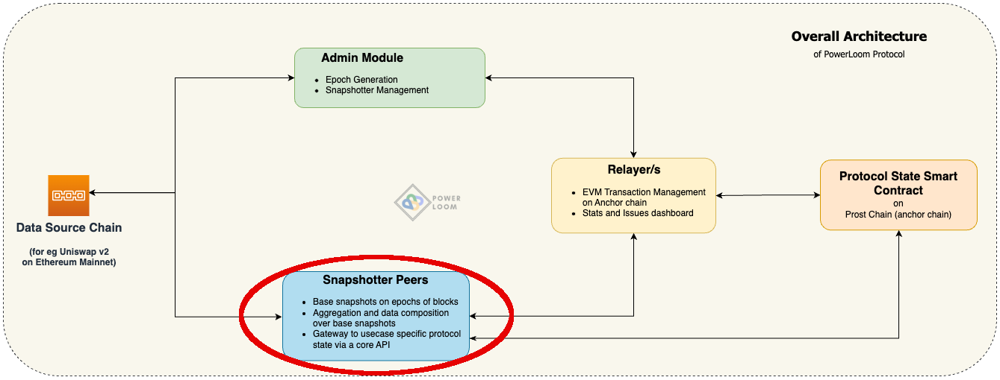

# Pooler Protocol Overview

The Powerloom Pooler is a special implementation of the [Snapshotter](https://github.com/PowerLoom/pooler/tree/main). It synchronizes with other snapshotter peers over a smart contract running on the current version of the PowerLoom Protocol testnet.

## Pooler snapshot data

Pooler will periodically query Uniswap smart contract liquidity pools on EVM-compatible blockchains. Itprovides access to rich aggregates which can be used to create detailled Uniswap v2 dashboards and applications.
Pooler exposes the following data points:

- Total Value Locked (TVL)
- Transactions containing `Swap`, `Mint`, and `Burn` events
- Trade Volume, Liquidity reserves, Fees earned
    - grouped by
        - Pair contracts
        - Individual tokens participating in pair contract
    - aggregated over time periods
        - 24 hours
        - 7 days

## Data aggregation process

Pooler tracks the blockchain on which the target Uniswap smart contract is hosted. At regular intervals (called "epochs"), Pooler will perform the following actions:

* snapshots raw smart contract state variables, event logs etc.. into "data blobs"
* indexes the data blob for better data accessibility, into "snapshots"
* propagates the snapshot accross the snapshotter peer-to-peer network

You can read more about the Powerloom Protocol, the Uniswap v2 PoC and its functional architecture in the [Powerloom Protocol Overview document](https://www.notion.so/powerloom/PowerLoom-Protocol-Overview-c3bf9dd9323541118d46a4d8684565d1#8ad76b8362b341bcaa9b3ae9fe203271)
